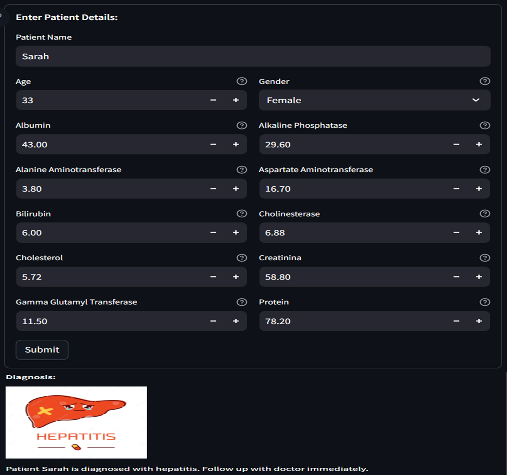

# Liver Disease Classification

## Overview

This repository contains a machine learning model designed to predict the category of liver disease based on various medical parameters. The model is trained on a dataset containing information about patients with liver disease.

## Dataset

The dataset used includes features such as:
•	Age 
•	Sex 
•	Albumin 
•	Alkaline Phosphatase 
•	Alanine Aminotransferase 
•	Aspartate Aminotransferase 
•	Bilirubin 
•	Cholinesterase 
•	Cholesterol 
•	Creatinina 
•	Gamma Glutamyl Transferase 
•	Protein

Predicted Category are:
•	No Disease 
•	Cirrhosis 
•	Hepatitis 
•	Fibrosis 
•	Suspect Disease

## Model Architecture

The model employed includes KNN, Logistic Regression, Decision Tree, Random Forest, SVM, and Naive Bayes to classify liver disease into different categories. Different methods, implementations, and strategies have been used in some of the models.

## Training and Evaluation

The model is trained using 80% of the entire dataset and tested with the remaining 20%. The model is evaluated using metrics such as accuracy, precision, recall, and F1-score. The model is also visualized using AUROC and AUPRC curves.

## Deployment

A user-friendly interface has been developed using Streamlit to facilitate inputting patient data and receiving predictions. To use it, simply run the following command:
**streamlit run Home.py**

